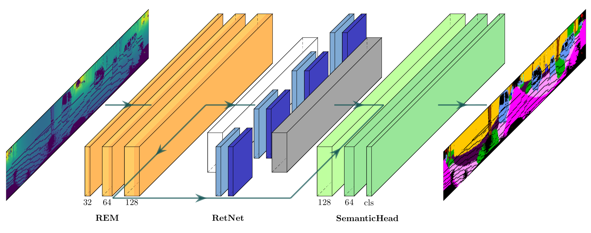

# RangeRet

Master's Thesis about 3D LiDAR Semantic Segmentation using Range Images and Retentive Networks.

<p align="center">
    
</p>

The purpose of the Thesis is the development of a lightweight model that is able to achieve real-time performance while requiring low amount of memory and an optimized training process.

## Installation

### Requirements

* Pytorch
* yaml
* tqdm

## Data Preparation

### SemanticKITTI

Download the files from the [SemanticKITTI website](http://semantic-kitti.org/dataset.html)

```
./semanticKITTI/
├── 
├── ...
└── dataset/
    ├──sequences
        ├── 00/           
        │   ├── velodyne/	
        |   |	├── 000000.bin
        |   |	├── 000001.bin
        |   |	└── ...
        │   └── labels/ 
        |       ├── 000000.label
        |       ├── 000001.label
        |       └── ...
        ├── 08/ # for validation
        ├── 11/ # 11-21 for testing
        └── 21/
	    └── ...
```

## Training

Run the following commands, specifying the SemanticKITTI dataset path

```
cd RangeRet
python3 main.py <config_path> <data_path>
```

Example: `python3 main.py config/RangeRet-semantickitti.yaml /semanticKITTI/dataset/`

Checkpoint will be saved in `checkpoints/model-checkpoint.pt`, the final model will be saved as `rangeret-model.pt` and training logs in `log/` with the current date and time.

## Inference

Run the following script, specifying the SemanticKITTI dataset path

```
cd RangeRet
python3 infer.py <config_path> <model_path> <data_path> <pred_path> <split>
```

where split can be `train`, `valid` or `test`.

Example of inference on SemanticKITTI validation set: `python3 infer.py config/RangeRet-semantickitti.yaml rangeret-model.pt /semanticKITTI/dataset predictions/ valid`

To correctly evaluate the results, please refer to the scripts available at [semantic-kitti-api](https://github.com/PRBonn/semantic-kitti-api).

## Results

| |Parameters|Inference (ms)|Memory (MB)|Val mIoU (%)|Test mIoU (%)|
|:---:|:---:|:---:|:---:|:---:|:---:|
|RangeRet|1.7M|49|2.0|46.9|45.2|

## Ablation Study

Models trained on a subest of SemanticKITTI with 5000 scans, equals to the 25% of the entire dataset, and evaluated on the complete validation set, sequence 08.

| REM | Architecture | Decay Matrix | Residual Connection | Params | mIoU (%) |
|:---:|:---:|:---:|:---:|:---:|:---:|
| Linear | Transformers | | | 1.49M | 30.1 |
| Conv  | Transformers | | | 1.56M  | 37.3 |
| Conv  | RetNet | Standard | | 1.69M | 37.8 |
| Conv  | RetNet | Our | | 1.69M | 40.3 |
| Conv | RetNet | Our | ✔ | 1.69M  | **42.3** |


## Thesis

Master Thesis document is available [here](https://hdl.handle.net/20.500.12608/60407)

## Acknowledgements

Code is built on [RangeNet++](https://github.com/PRBonn/lidar-bonnetal) and [Torchscale](https://github.com/microsoft/torchscale).