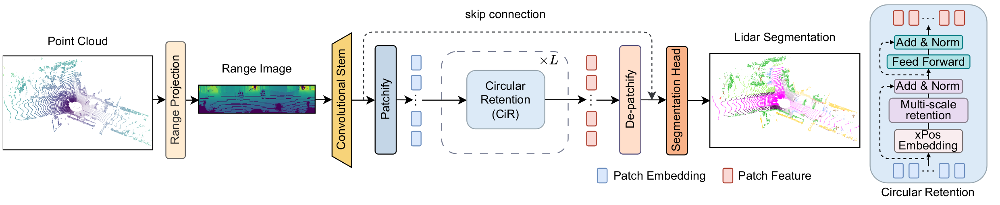

<div align="center">
<h1>Revisiting Retentive Networks for Fast Range-View 3D LiDAR Semantic Segmentation</h1>

[**Simone Mosco**](https://simom0.github.io/), [**Daniel Fusaro**](https://bender97.github.io/danielfusaro.github.io/), [**Wanmeng Li**](https://lichonger2.github.io/),
[**Alberto Pretto**](https://albertopretto.altervista.org/)

University of Padova

**WACV 2026**

<a href="#"></a>
<a href='https://huggingface.co/Simom0/RangeRet'></a>
<a href="https://www.youtube.com/watch?v=U68NkOMENNI"></a>



</div>

**RangeRet** is a lightweight LiDAR semantic segmentation approach that adapts Retentive Networks to range images using a Circular Retention (CiR) mechanism to efficiently model spatial continuty properties of range-view representation. RangeRet obtains SOTA results among range-view approaches on PandaSet and SemanticPOSS, and competitive results on SemanticKITTI, while achieving real-time performance. 

## News
- **2026-02-25**: Code and models are released.
- **2025-09-05**: RangeRet is accepted to WACV 2026.

## Installation

Create an environment and install the required packages with `pip install -r requirements.txt`.

In practice, you just need common packages as `torch`, `numpy`, `matplotlib`, `pyyaml`, `timm`, `tqdm`.

Code has been tested with the following versions of torch:

* torch 2.2.2 and CUDA 12.1
* torch 2.4.0 and CUDA 12.4

## Data Preparation

### SemanticKITTI

Download SemanticKITTI dataset from the [official website](https://semantic-kitti.org/).

### PandaSet

Download PandaSet dataset from the [official website](https://pandaset.org/) and raw Pandar64 LiDAR data from the link provided in this [Github Issue](https://github.com/scaleapi/pandaset-devkit/issues/67#issuecomment-674403708).

Follow the instructions on this [repo](https://github.com/SiMoM0/Pandaset2Kitti) to convert the PandaSet dataset to the SemanticKITTI format.

### SemanticPOSS

Download SemanticPOSS dataset from the [official website](http://www.poss.pku.edu.cn/semanticposs.html).


## Training

Run the following commands to train, specifying the dataset and log paths:

```shell
### SemanticKITTI
python train.py --dataset /path/to/semantickitti/ --data ./config/labels/semantic-kitti.yaml --config ./config/RangeRet-semantickitti.yaml --log ./log/kitti [--fp16]

### PandaSet
python train.py --dataset /path/to/pandaset/ --data ./config/labels/pandaset.yaml --config ./config/RangeRet-pandaset.yaml --log ./log/panda [--fp16]

### SemanticPOSS
python train.py --dataset /path/to/semanticposs/ --data ./config/labels/semantic-poss.yaml --config ./config/RangeRet-poss.yaml --log ./log/poss [--fp16]
```

## Testing

Run the following scripts to infer on a specific dataset:

```shell
### SemanticKITTI
python infer.py --dataset /path/to/semantickitti/ --data ./config/labels/semantic-kitti.yaml --config ./config/RangeRet-semantickitti.yaml --model /path/to/model.pt --split valid/test --log /path/to/predictions --fp16 [--save]

### PandaSet
python infer.py --dataset /path/to/pandaset/ --data ./config/labels/pandaset.yaml --config ./config/RangeRet-pandaset.yaml --model /path/to/model.pt --split valid/test --log /path/to/predictions --fp16 [--save]

### SemanticPOSS
python infer.py --dataset /path/to/semanticposs/ --data ./config/labels/semantic-poss.yaml --config ./config/RangeRet-poss.yaml --model /path/to/model.pt --split valid/test --log /path/to/predictions --fp16 [--save]

### E.g. for SemanticKITTI and pretrained model rangeret-kitti-657
# python3 infer.py --dataset /semanticKITTI/ --data ./config/labels/semantic-kitti.yaml --config config/RangeRet-semantickitti.yaml --model ./rangeret-kitti-657.pt --split valid --fp16 [--save] --log ./out/kitti_results
```


## Model Zoo

Pretrained models are available on [Hugging Face](https://huggingface.co/Simom0/RangeRet).

| Name | Dataset | Val mIoU (%) | Test mIoU (%) | Checkpoints |
|---|---|---|---|---|
| rangeret-kitti-657 | SemanticKITTI | 65.7 | 64.5 | [Download](https://huggingface.co/Simom0/RangeRet/resolve/main/rangeret-kitti-657.pt) |
| rangeret-panda-600 | PandaSet | 66.7 | 60.0 | [Download](https://huggingface.co/Simom0/RangeRet/resolve/main/rangeret-panda-600.pt) |
| rangeret-poss-528 | SemanticPOSS | - | 52.8 | [Download](https://huggingface.co/Simom0/RangeRet/resolve/main/rangeret-poss-528.pt) | 

## Checklist

- [x] Update README
- [x] Release code
- [x] Upload models
- [ ] Custom data guidelines

## Citation

If you find this project useful, please cite:

```
    Available soon
```


## Acknowledgment

Thanks to these great repositories: [RangeNet++](https://github.com/PRBonn/lidar-bonnetal), [Torchscale](https://github.com/microsoft/torchscale), [RMT](https://github.com/qhfan/RMT), [RangeViT](https://github.com/valeoai/rangevit), [Rangeview-rgb-lidar-fusion](https://github.com/nschi00/rangeview-rgb-lidar-fusion)